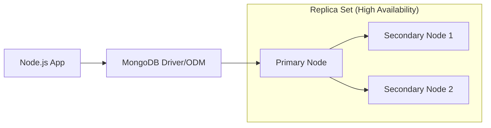
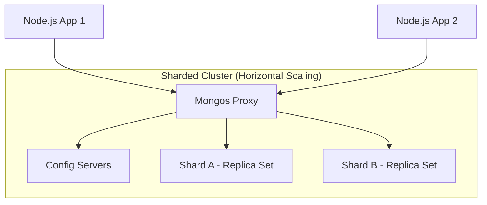

# MongoDB Mastery POC: Production-Grade Learning Monorepo

## 🏗 Architectural Matrix & Framework Selection

This repository is designed to master MongoDB through three distinct architectural lenses, each paired with a Node.js framework that complements the specific database use case.

| Project | Framework | MongoDB Interface | Focus Area | Rationale |
|:---|:---|:---|:---|:---|
| **01-Basic-CRUD** | Express.js | Mongoose | Fundamental Operators | Unopinionated simplicity for isolating core driver operations. |
| **02-Aggregation** | Fastify.js | Native Driver | Analytical Pipelines | High-performance routing and JSON schema validation for heavy data transformations. |
| **03-Indexing** | NestJS | Mongoose | Performance & Optimization | Strict TS architecture and DI for enterprise-level schema design and profiling. |

---

## 🗺 System Architecture Flow

### 1. Standard Application Flow (Replica Set)

### 2. Enterprise Sharded Topology

---

## 🚀 Getting Started

### Prerequisites
- Node.js (v18+)
- Docker & Docker Compose (for local MongoDB instance)
- MongoDB Compass (optional for visualization)

### Global Configuration
1. Clone the repository.
2. Each sub-project contains its own `package.json`.
3. Use the provided `docker-compose.yml` (if applicable) to spin up a local MongoDB cluster.

---

## 📚 Project Roadmap

- [ ] **Project 01**: Express.js - CRUD & Inbuilt Operators
- [ ] **Project 02**: Fastify.js - Advanced Aggregation Framework
- [ ] **Project 03**: NestJS - Indexing, Optimization & Profiling
