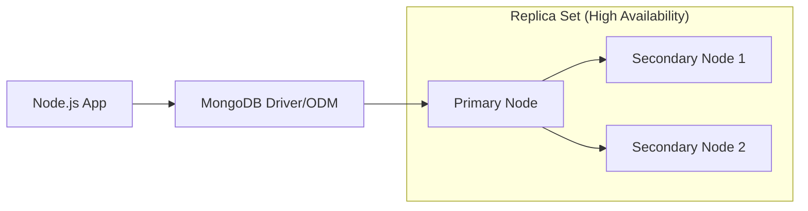
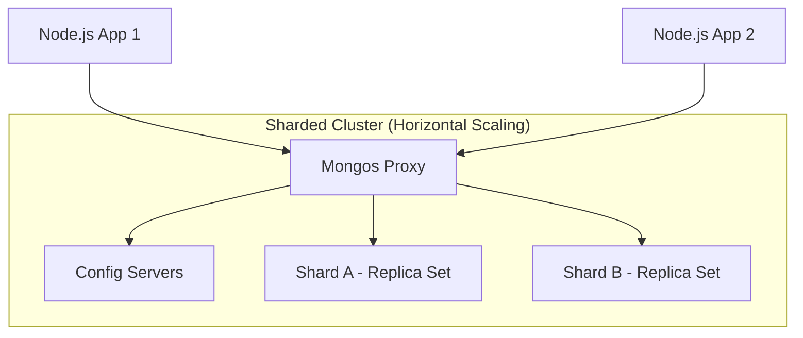

# MongoDB Mastery POC: Production-Grade Learning Monorepo

## 🏗 Architectural Matrix & Framework Selection

This repository is designed to master MongoDB through three distinct architectural lenses, each paired with a Node.js framework that complements the specific database use case.

| Project | Framework | MongoDB Interface | Focus Area | Rationale |
|:---|:---|:---|:---|:---|
| **01-Basic-CRUD** | Express.js | Mongoose | Fundamental Operators | Unopinionated simplicity for isolating core driver operations. |
| **02-Aggregation** | Fastify.js | Native Driver | Analytical Pipelines | High-performance routing and JSON schema validation for heavy data transformations. |
| **03-Indexing** | NestJS | Mongoose | Performance & Optimization | Strict TS architecture and DI for enterprise-level schema design and profiling. |

---

## 🗺 System Architecture Flow

### 1. Standard Application Flow (Replica Set)

### 2. Enterprise Sharded Topology

---

## 🚀 Getting Started

### Prerequisites
- Node.js (v18+)
- Docker & Docker Compose (for local MongoDB instance)
- MongoDB Compass (optional for visualization)

### Global Configuration
1. Clone the repository.
2. Each sub-project contains its own `package.json`.
3. Use the provided `docker-compose.yml` (if applicable) to spin up a local MongoDB cluster.

---

## 📚 Project Roadmap

- [ ] **Project 01**: Express.js - CRUD & Inbuilt Operators
- [ ] **Project 02**: Fastify.js - Advanced Aggregation Framework
- [ ] **Project 03**: NestJS - Indexing, Optimization & Profiling

## Check Mongodb index in mongo shell
### In MongoDB Shell (mongosh)
Run these commands against your database to get detailed stats directly from the terminal.

--JavaScript
// 1. List all indexes and their configurations for a specific collection
db.transactions.getIndexes()

// 2. See the total size of all indexes in bytes (Crucial for RAM management)
db.transactions.totalIndexSize()

// 3. See usage statistics (Find out if an index is never being used so you can delete it)
db.transactions.aggregate([ { $indexStats: { } } ])

## 1. Removing and "Updating" Indexes in MongoDB
First, I must be candid with you: you cannot directly "update" or modify an existing index in MongoDB. If you need to change an index (e.g., adding a new field to a single index to make it a compound index, or changing it from ascending to descending), you must drop the old index and create a new one.

Here are the commands you need in mongosh to manage this lifecycle.

Dropping a Specific Index
You can drop an index either by passing the exact document structure you used to create it, or by passing its internal name.

JavaScript
// Option A: Drop by the key pattern (Safest and most explicit)
db.users.dropIndex({ email: 1 })

// Option B: Drop by the index name. 
// (If you didn't specify a name during creation, MongoDB auto-generates one, usually "email_1")
db.users.dropIndex("email_1")
Dropping Multiple or All Indexes
JavaScript
// Drop multiple specific indexes at once (Pass an array of index names)
db.users.dropIndexes(["email_1", "status_1"])

// Drop ALL custom indexes on the collection
// NOTE: This will NOT drop the default _id index. That index is permanent.
db.users.dropIndexes()
The "Update" Workflow (Drop and Recreate)
If you realize you need a compound index instead of a single field index, do this sequentially:

JavaScript
// 1. Drop the old inadequate index
db.users.dropIndex({ email: 1 })

// 2. Create the new updated index
db.users.createIndex({ email: 1, status: 1 })
Architect's Tip (Hiding Indexes): If you are on MongoDB 4.4 or newer and you want to test if dropping an index will hurt performance before actually deleting it, you can hide it. A hidden index is ignored by the query planner but still updates in the background. If performance drops, unhide it. If performance is fine, drop it safely!

Hide: db.users.hideIndex({ email: 1 })

Unhide: db.users.unhideIndex({ email: 1 })

## 2. How to Read the Explain Plan (Index Detection)
When you run db.users.find({ email: "test@example.com" }).explain("executionStats"), MongoDB returns a large JSON object.

To know if your index was actually used, you need to look at two specific fields in that JSON output.

The Primary Indicator: stage
Look inside the queryPlanner.winningPlan object. You are looking for the stage field (sometimes this is nested inside an inputStage object).

🔴 "stage": "COLLSCAN" -> BAD. This means Collection Scan. No index was used. MongoDB had to look at every single document.

🟢 "stage": "IXSCAN" -> GOOD. This means Index Scan. MongoDB successfully found and used an index.

🟢 "stage": "IDHACK" -> EXCELLENT. This is a special, highly optimized index scan used only when you query specifically by the _id field.

The Secondary Indicators: The "Examined" Metrics
Scroll down to the executionStats object. You want to compare two specific numbers:

totalKeysExamined: This tells you exactly how many index entries MongoDB had to scan. If this number is 0, no index was used.

totalDocsExamined: This tells you how many actual documents MongoDB had to load into memory to return your results.

How to interpret them together:
If totalKeysExamined is 1 and totalDocsExamined is 1, you have a perfectly optimized query. The database found exactly 1 index key and loaded exactly 1 document.

Here is a visual snippet of what a successful, indexed query looks like in the output:

JSON
{
  "queryPlanner": {
    "winningPlan": {
      "stage": "FETCH",
      "inputStage": {
        "stage": "IXSCAN", // <--- HERE IT IS! (Index Scan)
        "keyPattern": {
          "email": 1
        },
        "indexName": "email_1", // Tells you exactly which index it used
        "isMultiKey": false
      }
    }
  },
  "executionStats": {
    "executionSuccess": true,
    "nReturned": 1,
    "executionTimeMillis": 2,
    "totalKeysExamined": 1, // <--- Touched 1 index entry
    "totalDocsExamined": 1  // <--- Loaded 1 document
  }
}

### The Three Verbosity Levels of `.explain()`

As an architect, it is crucial to understand that `.explain()` actually accepts three different "verbosity" modes. Knowing when to use which will save you a lot of time debugging in production:

| Verbosity Level | Command | When to use in Production |
| :--- | :--- | :--- |
| **1. Query Planner** (Default) | `.explain("queryPlanner")`   *or just* `.explain()` | MongoDB evaluates the query and tells you what index it plans to use, but it **does not actually run the query**. Use this for massive analytical queries where you don't want to wait 5 minutes just to see if your index works. |
| **2. Execution Stats** | `.explain("executionStats")` | MongoDB plans the query, **actually executes it**, and returns the real-world metrics (e.g., `executionTimeMillis`, `totalDocsExamined`). This is your go-to for performance tuning. |
| **3. All Plans Execution** | `.explain("allPlansExecution")` | MongoDB runs the query and tests multiple different indexes (if available) to see which is fastest. It shows you the stats for the "winning plan" and the "rejected plans." Use this when you have overlapping compound indexes and want to understand why MongoDB chose one over the other. |