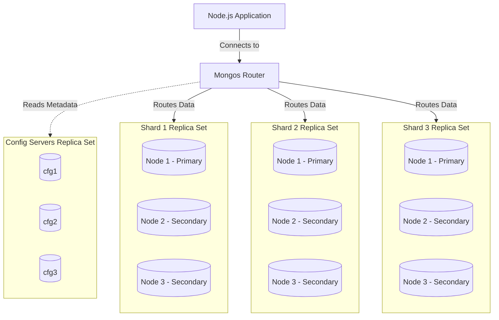
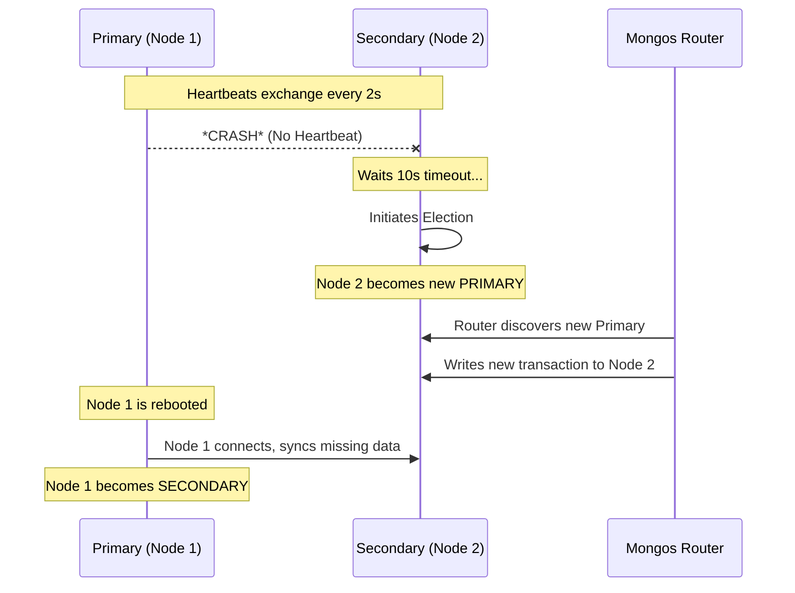

## Architectural Concepts

### Replica Sets (Safety & High Availability)
A Replica Set is a group of MongoDB instances that maintain the same data set. Provides zero downtime and data redundancy.

### Sharding (Scale & Infinite Storage)
Sharding distributes data across multiple machines. Provides horizontal scalability for massive datasets.

### The Ultimate Combo: Sharded Replica Sets
Every shard is its own Replica Set. Guarantees infinite scale (sharding) while remaining immune to server crashes (replicas).

### 1. Testing the Replica Set (High Availability)

The purpose of a replica set is to survive hardware failure. We test this by intentionally causing a "disaster."


**The Test (Chaos Engineering):**
1. **Identify the Primary:** First, check the status of Shard 1.
   `docker exec -it $(docker-compose ps -q shard1-node1) mongosh --eval 'rs.status()'`
   *Look for the node that says `"stateStr": "PRIMARY"`.*
2. **Simulate a Crash:** Kill that primary container abruptly. 
   `docker stop <primary_container_name>` (e.g., `docker stop index_masterclass-shard1-node1-1`)
3. **Verify the Failover:** Immediately log into one of the surviving nodes on that shard (e.g., `shard1-node2`). Run `rs.status()` again. You will see that one of the Secondaries has automatically been promoted to `"PRIMARY"`.
4. **Test the Application:** Connect to your `mongos` router and try to insert a new transaction. 
   *Because of the replica set, your application experiences zero downtime. The router seamlessly sends the write to the newly elected primary.*

### 2. Testing Sharding (Horizontal Scalability)

The purpose of sharding is to distribute query load so no single server does all the work. We test this by comparing how the `mongos` router handles different queries.


**The Test (Targeted vs. Broadcast Queries):**
Log into your router: `docker exec -it $(docker-compose ps -q mongos) mongosh` and run these two explain plans.

1. **Querying with the Shard Key (The Ideal Scenario)**
   Run: `db.getSiblingDB("fintech_db").transactions.find({ userId: "USER_45" }).explain()`
   * **What happens:** The router hashes `USER_45`, looks at the Config Servers, and realizes exactly which shard holds this user. 
   * **The Proof:** In the JSON output, look for the `shards` object. You will see that it only contacted **one** shard (e.g., `shard2ReplSet`). Shard 1 and Shard 3 were left completely alone to serve other users. This is a **Targeted Query**.

2. **Querying without the Shard Key (The Bottleneck Scenario)**
   Run: `db.getSiblingDB("fintech_db").transactions.find({ status: "completed" }).explain()`
   * **What happens:** The router does not know which shards hold "completed" statuses, because data was sharded by `userId`, not `status`. 
   * **The Proof:** In the JSON output, you will see it contacted **all three shards** (`shard1ReplSet`, `shard2ReplSet`, `shard3ReplSet`). It forced every single database server to search its data, and then the router merged the results. This is a **Scatter-Gather (Broadcast) Query**, and it is what you must avoid in high-throughput production environments.

## Architecture & Flow Diagrams

### Architecture Diagram: Sharded Cluster with Replica Sets


### Flow Diagram: Failover & Election Process

## Getting Started
1. **Start cluster:** `docker-compose up -d`
2. **Init cluster:** `./init-cluster.sh`
3. **Load data:** `./test-sharding.sh`

## How to Check Cluster State & Data

### View Shard Distribution
```bash
docker exec -it $(docker-compose ps -q mongos) mongosh --quiet --eval 'db.getSiblingDB("fintech_db").transactions.getShardDistribution()'
```

### Run the Failover Test
Run the automated failover script:
```bash
./test-failover.sh
```

## Oplog Use Case: Tailing Real-Time Data

**Architectural Insight:** You must write data through the `mongos` router, but the `oplog.rs` only exists on the actual physical data nodes (the Shards). 

Here is exactly how to set up this split-terminal experiment to watch the raw operations log in real time.

---

### Terminal 2: The "Watcher" (Tailing the Oplog)

We need to connect directly to the Primary node of Shard 1 (`shard1-node1`) because that is where the physical data (and the oplog) lives. 

MongoDB's oplog is a "capped collection." This means we can open a **Tailable Cursor** on it—a cursor that stays open and waits for new data, exactly like running `tail -f` on a Linux log file.

Open your second terminal and run this command. It will block and wait for new events:

```bash
docker exec -it $(docker-compose ps -q shard1-node1) mongosh --quiet --eval '
  print("👀 Tailing live oplog for fintech_db.transactions... (Press Ctrl+C to stop)");
  
  // Create a tailable cursor that waits for new data
  const cursor = db.getSiblingDB("local").oplog.rs
    .find({ ns: "fintech_db.transactions" }) // Only watch our specific collection
    .tailable({ awaitData: true });          // Keep connection open

  // Infinite loop to print new oplog entries as they arrive
  while (true) {
    if (cursor.hasNext()) {
      const doc = cursor.next();
      print("\n--- NEW EVENT DETECTED ---");
      print("Operation Type: " + (doc.op === "i" ? "INSERT" : doc.op === "u" ? "UPDATE" : doc.op === "d" ? "DELETE" : doc.op));
      printjson(doc.o); // doc.o contains the actual data payload
    } else {
      sleep(100); // Pause briefly if no new data to prevent CPU spiking
    }
  }
'