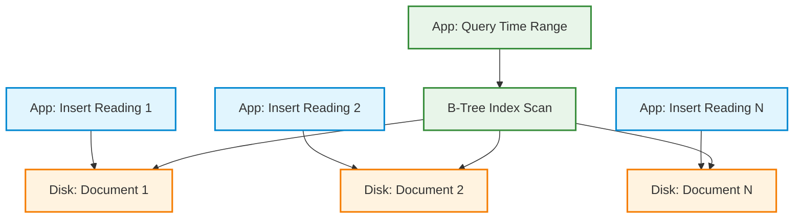
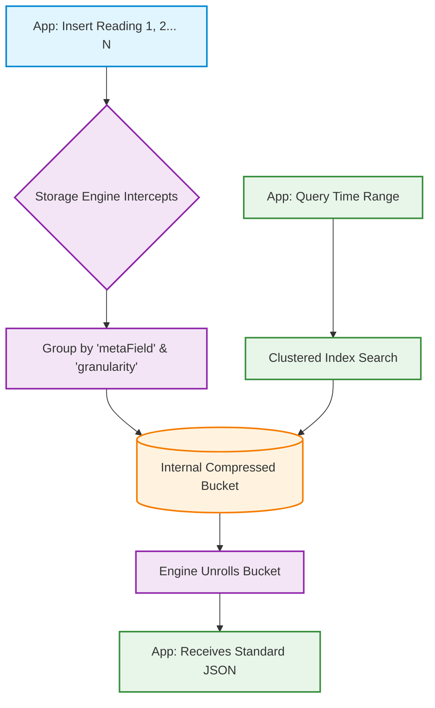

## MongoDB Time Series Architecture: Proof of Concept

This repository demonstrates how to architect, initialize, and query MongoDB Time Series collections using a Smart Greenhouse IoT scenario.

### What is a Time Series Collection?
Time Series collections are highly optimized storage structures in MongoDB designed specifically for data that is ingested continuously over time. Instead of storing data row-by-row, MongoDB intercepts the incoming JSON documents and dynamically groups them into highly compressed, columnar "buckets" on disk.

### Architectural Use Cases
*   **IoT & Telemetry:** Sensor readings, vehicle tracking, environmental monitoring.
*   **Financial Data:** High-frequency stock market ticks or crypto pricing.
*   **APM & Logging:** Server metrics (CPU/RAM) and application error rates.

### Normal Collections vs. Time Series Collections

| Feature | Normal Collection | Time Series Collection |
|---|---|---|
| **Storage Engine** | Row-based | Columnar (Bucket-based) |
| **Disk Footprint** | Standard | Extremely Low (highly compressed) |
| **Ingestion** | Standard | Optimized for high-throughput, append-only |
| **Query Speed** | Good (needs massive indexes) | Instant for time-range + metadata queries |

---

### Core Configuration Attributes
When creating a Time Series collection, the schema behavior is dictated by three critical fields:

1.  **`timeField` (Required):** The field containing the valid BSON Date object (e.g., `timestamp`).
2.  **`metaField` (Recommended):** The identifier that groups your data on disk. This should be the "thing" generating the data (e.g., `sensor_id`).
3.  **`granularity` (Optional):** Tells the storage engine the expected frequency of incoming data per metaField. Options are `"seconds"`, `"minutes"` (default), or `"hours"`.

---

### Running the Proof of Concept

This POC includes an automated shell script (`setup_timeseries.sh`) that uses `mongosh` to execute the complete lifecycle of a Time Series collection.

**What the script does:**
1. Connects to your MongoDB cluster.
2. Creates a Time Series collection named `greenhouse_metrics`.
3. Simulates 3 different sensors recording temperature and humidity every 15 minutes over the last 24 hours.
4. Executes a `$group` aggregation pipeline to calculate the average temperature and max humidity per sensor.

**Execution Steps:**

1. Ensure you have the [MongoDB Shell (mongosh)](https://www.mongodb.com/docs/mongodb-shell/install/) installed.
2. Make the script executable:
   ```bash
   chmod +x setup_timeseries.sh

### What is a Time Series Collection?
Time Series collections are highly optimized storage structures in MongoDB designed specifically for data that is ingested continuously over time. Instead of storing data row-by-row, MongoDB intercepts the incoming JSON documents and dynamically groups them into highly compressed, columnar "buckets" on disk.

---

### Architecture Comparison: Normal vs. Time Series

To understand the performance benefits, we must look at how data moves from the application layer to the disk, and back out during a query.

#### 1. The Normal Collection Architecture (Row-Based)
In a standard collection, every single insert results in a brand new, isolated document on disk. This repeats metadata (like the `sensor_id`) thousands of times and requires bulky B-Tree indexes to query efficiently.



## The Time Series Architecture (Columnar / Bucket-Based)

In a Time Series collection, the application thinks it is inserting standard JSON documents, but the MongoDB Storage Engine secretly intercepts them. It groups documents with the same metaField (e.g., sensor_alpha_1) and time range into a single, highly compressed internal "Bucket".


