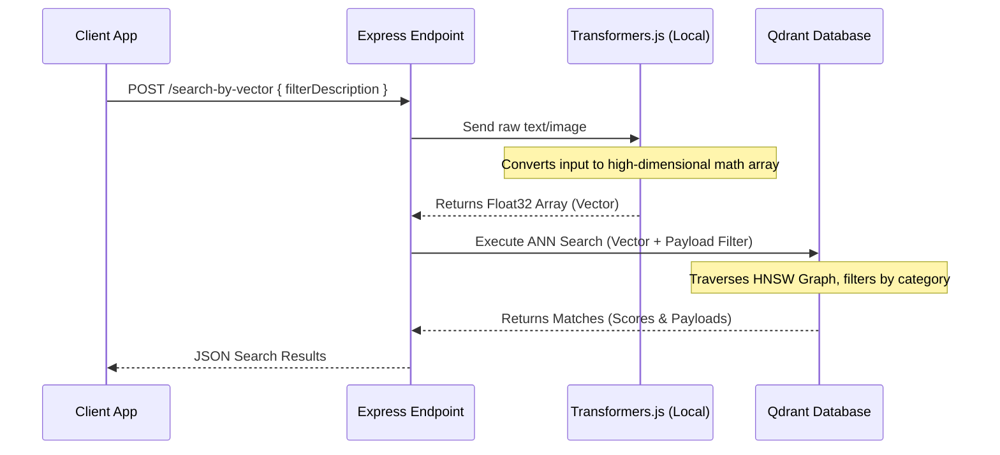
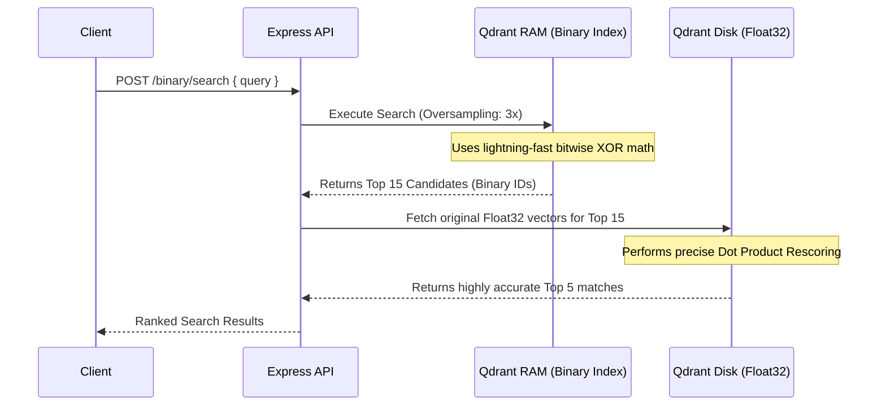
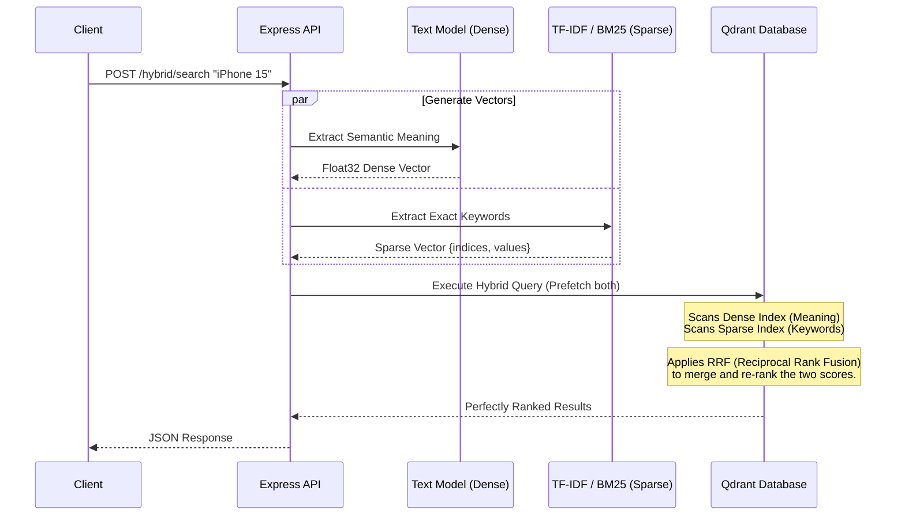

# Qdrant Vector Database - Production Architecture & Node.js/TypeScript POC

This repository contains an end-to-end Proof of Concept (POC) demonstrating how to integrate **Qdrant Vector Database** with **Node.js, TypeScript, Express, Sharp, and HuggingFace Transformers.js**.

---

## 1. Qdrant Architectural Concepts

### Core Data Structure
* **Collection**: Top-level container (similar to a SQL Table or MongoDB Collection). Enforces a fixed vector dimension count (e.g., 384 or 512) and a distance metric.
* **Point**: The core record in Qdrant consisting of:
  * `id`: 64-bit Unsigned Integer or UUID string.
  * `vector`: Array of floating-point numbers representing position in spatial dimensions.
  * `payload`: Arbitrary JSON metadata attached to the point.

### Distance Metrics Supported
1. **Cosine Similarity**: Measures the direction/angle between vectors, ignoring magnitude. Ideal for text embeddings (e.g., Sentence-Transformers).
2. **Dot Product (`Dot`)**: Measures both angle and magnitude. Computationally faster than Cosine when vectors are normalized.
3. **Euclidean Distance (`Euclid`)**: Straight-line physical distance between vector endpoints in multi-dimensional space.

### Indexing Mechanisms
* **HNSW (Hierarchical Navigable Small World)**: A multi-layer graph index used by Qdrant for Approximate Nearest Neighbor (ANN) search. Delivers sub-10ms query times across millions of vectors.
* **Payload Indexing**: Allows indexing specific JSON fields inside point payloads for hybrid filtering during graph traversal.

---

## 2. System Architecture & Data Flow Diagram

```mermiad
graph TD
    Client[Client Application] --> API[Express.js API]
    
    subgraph Node.js Backend
        API --> TextRoute[Text Services]
        API --> VisionRoute[Vision Services]
        
        TextRoute --> MiniLM["all-MiniLM-L6-v2<br>(384-dim Dense Vector)"]
        VisionRoute --> Sharp[Sharp Image Preprocessor]
        Sharp --> CLIP["CLIP ViT-B/32<br>(512-dim Dense Vector)"]
    end
    
    subgraph Qdrant Vector Database
        MiniLM --> Q1[(products_text)]
        CLIP --> Q2[(text_to_image_collection)]
        CLIP --> Q3[(image_to_image_collection)]
    end
    
    Q1 -.-> UI[Qdrant Web UI Dashboard<br>Port 6333]
    Q2 -.-> UI
    Q3 -.-> UI
```
### Data Ingestion & Search Execution Flow


## Enterprise Scale: Vector Quantization

When scaling to millions of records, pure Float32 vectors will exhaust server RAM. Qdrant solves this using **Quantization**—compressing vectors in memory while retaining the original Float32 vectors on the SSD for final re-scoring.

### The Three Tiers of Quantization
1. **Scalar Quantization (Int8):** Shrinks 32-bit floats into 8-bit integers. Reduces RAM footprint by **75%**.
2. **Product Quantization (PQ / Int4):** Chunks dimensions into groups and maps them to centroids. Reduces RAM by up to **97%**.
3. **Binary Quantization (BQ):** Converts floats directly into 1-bit (`0` or `1`) based on whether they are positive or negative. Uses bitwise XOR for search. Reduces RAM by **96.8%** and increases query speed by up to **40x**.

### Data Flow Diagram: Binary Quantization with Oversampling


## Deep Dive: How Quantization Alters Data Internally

When you generate a vector using `all-MiniLM-L6-v2`, it produces an array of **384 Float32 (32-bit floating-point) numbers**. A single Float32 takes 4 bytes of memory. 
* **Original Vector (Before):** `[0.152, -0.841, 0.999, 0.045, -0.112, ... 379 more]`
* **Original Size:** 384 dimensions × 4 bytes = **1,536 bytes per vector.**

Here is exactly how Qdrant transforms and stores this data internally for each quantization method.

### 1. Scalar Quantization (Int8)
Scalar quantization looks at the minimum and maximum values across your entire dataset and scales them into whole numbers between `-128` and `127` (an 8-bit integer). 

* **Before (Float32):** `[0.152, -0.841, 0.999, 0.045, ...]`
* **After (Int8):** `[39, -214, 255, 11, ...]`
* **Internal Storage:** Qdrant stores the array of 8-bit integers in RAM. 
* **Math:** 384 dimensions × 1 byte = **384 bytes**. (75% RAM savings).
* **Search Execution:** The CPU performs integer math, which is significantly faster than floating-point math.

### 2. Product Quantization (PQ / x16)
PQ is a machine-learning compression technique. Instead of compressing individual numbers, it chunks the vector into pieces and replaces them with IDs from a "codebook".

* **The Chunking Process:** Qdrant takes the 384 dimensions and splits them into 16 chunks (if using `x16` compression). Each chunk contains 24 numbers (384 / 16 = 24).
* **The Codebook:** Qdrant analyzes the dataset and creates a "dictionary" of 256 common patterns (centroids) for these 24-number chunks.
* **Before (Float32):** `[ (Chunk 1: 24 floats), (Chunk 2: 24 floats), ... (Chunk 16: 24 floats) ]`
* **After (PQ IDs):** `[ 42, 115, 7, ... 13 more IDs ]`
* **Internal Storage:** Qdrant drops the raw floats and only stores the **ID** of the closest dictionary pattern for each chunk.
* **Math:** 16 chunks × 1 byte (to store an ID up to 256) = **16 bytes**. (98.9% RAM savings).

### 3. Binary Quantization (BQ)
BQ relies on the concept that for some high-dimensional models, the *direction* (positive or negative) of the number matters much more than the *magnitude* (the actual decimal value).

* **The Rule:** If float > 0, store `1`. If float < 0, store `0`.
* **Before (Float32):** `[0.152, -0.841, 0.999, -0.112, ...]`
* **After (Bits):** `1, 0, 1, 0, ...`
* **Internal Storage:** Qdrant packs these bits directly into memory. It takes 8 bits to make 1 byte.
* **Math:** 384 bits / 8 bits per byte = **48 bytes**. (96.8% RAM savings).
* **Search Execution:** Qdrant uses a bitwise `XOR` operation (Hamming Distance) to compare vectors. Because CPUs process 64 bits per clock cycle naturally, comparing binary vectors is up to 40x faster than Float32.

## Enterprise Scale: Hybrid Search (Dense + Sparse Vectors)

Semantic search (Dense vectors) understands meaning, but it struggles with exact keywords, serial numbers, or acronyms. **Hybrid Search** combines two different mathematical representations of your data into a single query to get the best of both worlds.

### How Data Changes Before & After Insertion

#### 1. Dense Vectors (Semantic Meaning)
Generated by deep learning models like MiniLM or OpenAI.
* **Before (String):** `"Apple iPhone 15 Pro Max"`
* **After (Float32 Array):** `[0.112, -0.992, 0.441, ... 381 more]` (Always exactly 384 dimensions)
* **Internal Storage:** Stored as a fixed-length array. If a document doesn't mention "iPhone", the dimension representing "Apple products" might be close to `0`, but it still takes up space.

#### 2. Sparse Vectors (Exact Keywords / Lexical)
Generated by token-frequency algorithms like BM25 or SPLADE.
* **Before (String):** `"Apple iPhone 15 Pro Max"`
* **After (Index-Value Pairs):** `{ indices: [492, 881, 9021], values: [1.5, 0.8, 2.1] }`
* **Internal Storage:** Stored as a sparse map. Imagine an array with 30,000 dimensions (the size of the English dictionary). Most words aren't in the document, so they are `0`. Qdrant **only stores the non-zero values**, saving massive amounts of memory.

### Data Flow Diagram: Hybrid Search Execution

